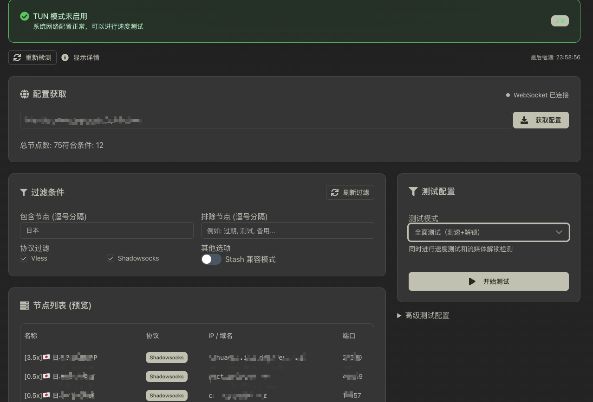

# Clash SpeedTest Pro

> Professional proxy speed testing tool - 专业的代理节点性能测试工具

[](https://golang.org/)
[](https://nodejs.org/)
[](LICENSE)
[](https://github.com/zhsama/clash-speedtest)

**English Documentation | [中文文档](README_ZH.md)**

Professional proxy speed testing tool based on Clash/Mihomo core, providing both command-line interface and modern web UI with real-time progress display and streaming media unlock detection.



## 🚀 Key Features

### 🎯 Testing Capabilities

- **Direct Testing**: No additional configuration needed, directly reads Clash/Mihomo config files or subscription URLs
- **High Performance**: Supports concurrent testing for rapid proxy performance data acquisition
- **Dual Mode**: Simultaneous speed testing and streaming media unlock detection
- **Smart Filtering**: Multiple filtering conditions (speed, latency, protocol type, node names, etc.)

### 🌐 User Interface

- **Modern Interface**: Modern web interface built with React/TypeScript
- **Real-time Progress**: WebSocket real-time display of test progress and results
- **Responsive Design**: Perfect adaptation for desktop and mobile devices
- **Export Function**: Support for Markdown and CSV format export of test results

### 🔓 Unlock Detection

Support for 30+ streaming platforms including:

- Netflix, YouTube, Disney+, ChatGPT
- Spotify, Bilibili, HBO Max, Hulu
- Amazon Prime Video, Paramount+, Peacock
- And more international and regional platforms

### 🛡️ Security & Reliability

- **Open Source**: Fully open source with auditable code
- **Local Operation**: Protects proxy privacy, no data upload
- **Cross-platform**: Supports Windows, macOS, Linux

## 📦 Installation Methods

### Method 1: One-click Development Environment (Recommended)

```bash
# Clone repository
git clone https://github.com/zhsama/clash-speedtest.git
cd clash-speedtest

# Install dependencies and start complete development environment
pnpm install
pnpm dev

# Access Web UI: http://localhost:3000
# Backend API: http://localhost:8080
```

### Method 2: Go Install (CLI Version)

```bash
go install github.com/zhsama/clash-speedtest@latest
```

### Method 3: Pre-compiled Binaries

Download corresponding platform binaries from [Releases](https://github.com/zhsama/clash-speedtest/releases) page.

### Method 4: Docker Deployment

```bash
# Build and start services
docker-compose up -d

# Or use optimized version
docker-compose -f docker-compose.optimized.yml up -d
```

## 🎯 Usage

### Web Interface Usage (Recommended)

#### 1. Start Services

```bash
# Complete environment startup
pnpm dev

# Or start separately
pnpm dev:backend  # Start backend API service
pnpm dev:frontend # Start frontend interface
```

#### 2. Using Web Interface

1. Open browser and visit `http://localhost:3000`
2. Enter config file path or subscription URL in "Config Fetch" section
3. Click "Fetch Config" to load node list
4. Configure test parameters:
   - **Test Mode**: Comprehensive test (Speed+Unlock) / Speed only / Unlock only
   - **Node Filtering**: Include/exclude specific nodes, protocol type filtering
   - **Speed Filtering**: Set minimum speed and maximum latency thresholds
   - **Advanced Config**: Concurrency, timeout, test package size, etc.
5. Click "Start Test" to begin testing, view progress and results in real-time
6. Export test reports in Markdown or CSV format after completion

#### 3. Web Interface Features

- **Real-time Progress**: Real-time test progress display via WebSocket
- **Node Preview**: Preview eligible nodes before testing
- **Smart Filtering**: Support for Chinese/English comma-separated node filtering
- **TUN Mode Detection**: Automatic detection and TUN mode status alerts
- **Result Export**: Smart file naming with config source information

### Command Line Usage

```bash
# View help
clash-speedtest -h

# Examples:

# 1. Test all nodes using HTTP subscription URL
# Add flag=meta parameter to subscription URL for proper node type recognition
clash-speedtest -c 'https://domain.com/api/v1/client/subscribe?token=secret&flag=meta'

# 2. Test Hong Kong nodes using regex filtering with local file
clash-speedtest -c ~/.config/clash/config.yaml -f 'HK|港'

# 3. Mixed usage with multiple config sources
clash-speedtest -c "https://domain.com/api/v1/client/subscribe?token=secret&flag=meta,/home/.config/clash/config.yaml"

# 4. Filter nodes with latency < 800ms and download speed > 5MB/s, output to filtered.yaml
clash-speedtest -c "https://domain.com/api/v1/client/subscribe?token=secret&flag=meta" -output filtered.yaml -max-latency 800ms -min-speed 5

# 5. Use -rename option to rename nodes with IP location and download speed
clash-speedtest -c config.yaml -output result.yaml -rename
# Renamed node format: 🇺🇸 US | ⬇️ 15.67 MB/s
```

## 🏗️ Project Architecture

### Tech Stack

- **Backend**: Go + Gin + WebSocket + Mihomo Core
- **Frontend**: React + TypeScript + Astro + Tailwind CSS
- **Build Tools**: Turborepo + Vite + pnpm
- **Containerization**: Docker + Multi-stage builds
- **Deployment**: GitHub Actions + Automated releases

### Directory Structure

```
clash-speedtest/
├── backend/                 # Go backend service
│   ├── main.go             # Main program entry
│   ├── server/             # HTTP/WebSocket services
│   ├── speedtester/        # Core speed testing logic
│   ├── unlock/             # Streaming unlock detection
│   ├── detectors/          # Platform detectors
│   ├── websocket/          # WebSocket real-time communication
│   ├── tasks/              # Async task management
│   ├── utils/              # Utility functions
│   └── download-server/    # Optional self-hosted speed test server
├── frontend/               # React/TypeScript frontend
│   ├── src/
│   │   ├── components/     # React components
│   │   │   ├── SpeedTest.tsx           # Main test component
│   │   │   ├── RealTimeProgressTable.tsx  # Real-time progress table
│   │   │   ├── SpeedTestTable.tsx      # Speed test table
│   │   │   ├── UnlockTestTable.tsx     # Unlock test table
│   │   │   └── TUNWarning.tsx          # TUN mode detection
│   │   ├── hooks/          # Custom hooks
│   │   │   └── useWebSocket.ts         # WebSocket management
│   │   ├── lib/            # Utility libraries
│   │   └── styles/         # Style files
│   ├── public/             # Static assets
│   └── package.json
├── docs/                   # Project documentation
│   ├── dev-docs/           # Development docs
│   ├── test-docs/          # Testing docs
│   └── docker/             # Docker docs
├── scripts/                # Build scripts
├── turbo.json              # Turborepo configuration
├── package.json            # Root configuration
└── README.md
```

### Core Modules

#### 1. Backend Architecture (Go)

- **SpeedTester**: Core speed testing engine with Mihomo (Clash) core integration
- **Unlock Detector**: 30+ platform streaming unlock detection
- **WebSocket Server**: Real-time communication service
- **Task Manager**: Async task scheduling and management
- **Config Loader**: Support for local files and remote subscriptions
- **Export Utils**: Result export and formatting

#### 2. Frontend Architecture (React/TypeScript)

- **SpeedTest**: Main test control component
- **RealTimeProgressTable**: Real-time progress and result display
- **WebSocket Hook**: Real-time communication state management
- **UI Components**: Component library based on shadcn/ui
- **Export System**: Smart file export functionality

#### 3. Build System (Turborepo)

- **Parallel Builds**: Simultaneous frontend and backend build optimization
- **Smart Caching**: Incremental builds and task caching
- **Docker Integration**: Multi-stage build optimization
- **CI/CD Integration**: GitHub Actions automation

## 📡 API Documentation

### REST API Endpoints

```bash
# Get node list
POST /api/nodes
Content-Type: application/json
{
  "configPaths": "config.yaml",
  "stashCompatible": false
}

# Start async test
POST /api/test/async
Content-Type: application/json
{
  "configPaths": "config.yaml",
  "testMode": "both",           # both/speed_only/unlock_only
  "concurrent": 4,
  "timeout": 10,
  "unlockPlatforms": ["Netflix", "YouTube"],
  "unlockConcurrent": 5,
  "unlockTimeout": 10
}

# Get unlock detection platform list
GET /api/unlock/platforms

# Check TUN mode status
GET /api/tun-check

# System information
GET /api/system/info
```

### WebSocket API

```bash
# Connect WebSocket
ws://localhost:8080/ws

# Test progress message
{
  "type": "test_progress",
  "data": {
    "current_proxy": "Node Name",
    "completed_count": 5,
    "total_count": 20,
    "progress_percent": 25.0,
    "status": "testing",
    "current_stage": "speed_test",
    "unlock_platform": "Netflix"
  }
}

# Test result message
{
  "type": "test_result", 
  "data": {
    "proxy_name": "Node Name",
    "proxy_type": "vmess",
    "proxy_ip": "1.2.3.4",
    "download_speed_mbps": 15.67,
    "upload_speed_mbps": 8.32,
    "latency_ms": 120,
    "jitter_ms": 5.2,
    "packet_loss": 0.1,
    "unlock_results": [
      {
        "platform": "Netflix",
        "supported": true,
        "region": "US"
      }
    ],
    "status": "success"
  }
}

# Test complete message
{
  "type": "test_complete",
  "data": {
    "successful_tests": 18,
    "failed_tests": 2,
    "total_tested": 20,
    "total_duration": "2m30s",
    "average_latency": 156.5,
    "average_download_mbps": 45.8,
    "average_upload_mbps": 18.3,
    "best_proxy": "Fastest Node Name",
    "best_download_speed_mbps": 78.9,
    "unlock_stats": {
      "successful_unlock_tests": 25,
      "total_unlock_tests": 40,
      "best_unlock_proxy": "Best Unlock Node",
      "best_unlock_platforms": ["Netflix", "YouTube", "Disney+"]
    }
  }
}
```

## 🔧 Development Environment Setup

### Prerequisites

- **Go**: 1.19+ (Backend development)
- **Node.js**: 18.0+ (Frontend development)
- **pnpm**: 8.0+ (Package manager)
- **Docker**: 20.0+ (Optional, for containerized deployment)

### Quick Start

#### 1. Clone Project

```bash
git clone https://github.com/zhsama/clash-speedtest.git
cd clash-speedtest
```

#### 2. Install Dependencies

```bash
# Install all dependencies (frontend + backend)
pnpm install
```

#### 3. Start Development Environment

```bash
# Method 1: Start frontend and backend simultaneously (Recommended)
pnpm dev

# Method 2: Start separately  
pnpm dev:backend   # Start backend API service (port 8080)
pnpm dev:frontend  # Start frontend interface (port 3000)

# Method 3: Backend API only
pnpm dev:api
```

#### 4. Access Application

- **Frontend Interface**: <http://localhost:3000>
- **Backend API**: <http://localhost:8080>
- **API Documentation**: <http://localhost:8080/api/docs>

### Project Scripts

```bash
# Development related
pnpm dev              # Start complete development environment
pnpm dev:frontend     # Frontend only
pnpm dev:backend      # Backend only
pnpm debug            # Start debug mode

# Build related
pnpm build            # Build frontend and backend
pnpm build:frontend   # Frontend only
pnpm build:backend    # Backend only
pnpm build:docker     # Docker image build

# Quality control
pnpm test             # Run all tests
pnpm lint             # Code linting
pnpm typecheck        # Type checking
pnpm format           # Code formatting

# Cleanup
pnpm clean            # Clean build files
pnpm clean:cache      # Clean Turbo cache
```

### VS Code Debug Configuration

Complete VS Code debug environment configured:

1. **Debug Backend**: Press F5 and select "Debug Backend" configuration
2. **Debug Frontend**: Press F5 and select "Debug Frontend" configuration
3. **Debug Delve**: Use "Attach to Delve" configuration for deep debugging

### Environment Variables

```bash
# Frontend environment variables (frontend/.env.local)
VITE_API_URL=http://localhost:8080
VITE_WS_URL=ws://localhost:8080

# Backend environment variables
SERVER_PORT=8080
SERVER_HOST=0.0.0.0
LOGGER_LEVEL=INFO
LOGGER_OUTPUT_TO_FILE=true
```

## 🐳 Docker Deployment

### Quick Start

```bash
# Development environment
docker-compose up -d

# Production environment (optimized version)
docker-compose -f docker-compose.optimized.yml up -d
```

### Build Images

```bash
# Build all images
pnpm build:docker

# Manual build
docker build -t clash-speedtest-backend ./backend
docker build -t clash-speedtest-frontend ./frontend
```

### Docker Features

- **Multi-stage builds**: Minimize image size
- **UPX compression**: Binary compression reduces 60%+ size
- **Distroless base images**: Enhanced security
- **Health checks**: Automatic service status monitoring

## 📋 Configuration Files

### Backend Configuration (backend/config.yaml)

```yaml
server:
  port: 8080
  host: "0.0.0.0"
  cors:
    enabled: true
    allowed_origins: ["http://localhost:3000"]

logger:
  level: "INFO"                    # DEBUG/INFO/WARN/ERROR
  output_to_file: true
  log_dir: "logs"
  log_file_name: "clash-speedtest.log"
  max_size: 10485760              # 10MB
  max_files: 5
  rotate_on_start: true
  enable_console: true
  format: "text"                  # text/json

unlock:
  cache_enabled: true
  cache_duration: "1h"
  timeout: "10s"
  retry_count: 3
  concurrent: 5
```

### Frontend Configuration (frontend/astro.config.mjs)

```javascript
export default defineConfig({
  integrations: [
    react(),
    tailwind({ applyBaseStyles: false })
  ],
  server: {
    port: 3000,
    host: true
  },
  vite: {
    define: {
      'import.meta.env.VITE_API_URL': JSON.stringify(process.env.VITE_API_URL || 'http://localhost:8080'),
      'import.meta.env.VITE_WS_URL': JSON.stringify(process.env.VITE_WS_URL || 'ws://localhost:8080')
    }
  }
})
```

## 🧪 Testing

### Run Tests

```bash
# Run all tests
pnpm test

# Backend tests
cd backend && go test ./...

# Frontend tests
cd frontend && pnpm test

# End-to-end tests
pnpm test:e2e
```

### Performance Testing

```bash
# Speed testing performance benchmark
go run main.go -c config.yaml -concurrent 16

# Memory usage monitoring
go run main.go -c config.yaml -memprofile mem.prof

# Docker image size testing
./scripts/analyze-docker-size.sh
```

### Testing Strategy

1. **Unit Testing**: Core functionality module testing
2. **Integration Testing**: API interface and WebSocket testing
3. **End-to-End Testing**: Complete user workflow testing
4. **Performance Testing**: Concurrency and memory usage testing
5. **Docker Testing**: Containerized deployment testing

## 🔍 Troubleshooting

### Common Issues

**Q: Inaccurate test results?**
A: Recommend disabling system TUN mode, use Stash compatible mode. The app will automatically detect and alert about TUN mode status.

**Q: Subscription URL unable to fetch nodes?**
A: Ensure subscription URL contains `&flag=meta` parameter. Support comma-separated multiple config sources.

**Q: WebSocket connection failed?**
A: Check firewall settings, ensure port 8080 is not occupied, check browser console for error messages.

**Q: Frontend cannot connect to backend?**
A: Check if backend is running properly, confirm API address configuration in environment variables is correct.

**Q: Compilation failed?**
A: Ensure Go version >= 1.19, Node.js >= 18.0, run `go mod tidy && pnpm install`.

**Q: Docker build failed?**
A: Check Docker version, ensure multi-stage builds support, review build logs.

### Debug Mode

```bash
# Enable verbose logging
go run main.go -config=config-debug.yaml

# Use Delve debugger
dlv debug --headless --listen=:2345 --api-version=2 --accept-multiclient main.go -- -config=config-debug.yaml

# Frontend debugging
cd frontend && pnpm dev --debug

# View build cache
pnpm turbo:info
```

### Log Analysis

```bash
# View backend logs
tail -f backend/logs/clash-speedtest.log

# View Docker container logs
docker-compose logs -f backend
docker-compose logs -f frontend

# View build logs
pnpm build 2>&1 | tee build.log
```

## 📈 Performance Optimization Tips

### Test Parameter Optimization

1. **Concurrency Adjustment**: Adjust concurrent parameter based on network conditions (recommended 4-8)
2. **Timeout Settings**: Reasonable timeout settings to skip slow nodes (recommended 10-30s)
3. **Package Size**: Adjust downloadSize based on bandwidth (10-100MB)
4. **Unlock Concurrency**: Unlock detection concurrency (recommended 3-5)

### System Optimization

1. **Memory Management**: Appropriately reduce concurrency for large-scale node testing
2. **Network Optimization**: Use wired network, close other network applications
3. **System Configuration**: Disable TUN mode for more accurate results
4. **Proxy Settings**: Avoid using system proxy affecting test results

### Build Optimization

1. **Turbo Cache**: Utilize Turborepo incremental builds
2. **Docker Optimization**: Multi-stage builds reduce image size
3. **Parallel Builds**: Frontend and backend parallel builds improve efficiency
4. **Dependency Optimization**: Regular cleanup and dependency updates

## 🧠 Speed Testing Principles

### Testing Mechanism

Tests node performance through HTTP GET/POST requests, defaults to using <https://speed.cloudflare.com> for testing.

### Test Metrics Explanation

1. **Download Speed**: Speed of downloading specified file size, reflects node's egress bandwidth
2. **Upload Speed**: Speed of uploading specified file size, reflects node's upload bandwidth
3. **Latency**: HTTP GET request TTFB (Time To First Byte), reflects network latency
4. **Jitter**: Latency variation amplitude, reflects network stability
5. **Packet Loss**: Percentage of lost data packets, reflects network quality
6. **Unlock Status**: Access detection results for various streaming platforms

### Unlock Detection Principles

Determines unlock status by accessing specific detection endpoints of each platform and analyzing returned content:

- **Netflix**: Detects regional library availability
- **YouTube**: Detects geographically restricted content
- **Disney+**: Detects service availability and region
- **ChatGPT**: Detects API access restrictions
- **Other Platforms**: Specialized detection based on platform characteristics

### Important Notes

Note that bandwidth and latency are two independent metrics:

1. **High Bandwidth + High Latency**: Fast downloads but slow webpage loading (transit nodes without BGP acceleration)
2. **Low Bandwidth + Low Latency**: Fast webpage loading but slow downloads (smaller IEPL/IPLC bandwidth)

### Self-hosted Speed Test Server

```bash
# Install and start on speed test server
go install github.com/zhsama/clash-speedtest/download-server@latest
download-server

# Use self-hosted server for testing
clash-speedtest --server-url "http://your-server-ip:8080"
```

## 🤝 Contributing

We welcome all forms of contributions!

### Development Process

1. Fork the project to your GitHub account
2. Create feature branch (`git checkout -b feature/amazing-feature`)
3. Develop and test
4. Commit changes (`git commit -m 'feat: add amazing feature'`)
5. Push to branch (`git push origin feature/amazing-feature`)
6. Create Pull Request

### Commit Standards

Use [Conventional Commits](https://www.conventionalcommits.org/) specification:

```bash
feat: new feature
fix: bug fix
docs: documentation update
style: code formatting
refactor: refactoring
test: testing
chore: build tools, auxiliary tools changes
```

### Code Standards

```bash
# Backend code checking
cd backend
go fmt ./...
go vet ./...
golangci-lint run

# Frontend code checking
cd frontend
pnpm lint
pnpm typecheck
pnpm format
```

### Development Suggestions

1. **Single Responsibility**: Each PR focuses on single functionality or fix
2. **Test Coverage**: Add corresponding tests for new features
3. **Documentation Updates**: Update relevant documentation and README
4. **Backward Compatibility**: Avoid breaking changes
5. **Performance Considerations**: Consider impact of new features on performance

## 📋 TODO List

### 🐳 Docker Optimization Plan

- [ ] **Container Orchestration Optimization**
  - [ ] Add Kubernetes deployment configuration
  - [ ] Optimize Docker Compose health checks
  - [ ] Docker Swarm support integration
  - [ ] Add container monitoring and log aggregation

- [ ] **Image Optimization**
  - [ ] Further reduce image size (target < 20MB)
  - [ ] Add multi-architecture support (ARM64/AMD64)
  - [ ] Implement image security scanning
  - [ ] Optimize layer caching strategy

### 🔓 Streaming Unlock Detection Enhancement

- [ ] **Platform Expansion**
  - [ ] Add more international platforms (Crunchyroll, Funimation, VRV)
  - [ ] Support mainland China platforms (iQiyi, Tencent Video, Youku)
  - [ ] Add music platform detection (Apple Music, Pandora)
  - [ ] Support gaming platform detection (Steam, Epic Games)

- [ ] **Detection Capability Enhancement**
  - [ ] Implement precise regional detection (city-level)
  - [ ] Add unlock quality assessment (4K, HDR support)
  - [ ] Support custom detection rules
  - [ ] Implement batch platform detection optimization

- [ ] **Unlock Result Improvements**
  - [ ] Add historical unlock record comparison
  - [ ] Implement unlock status change notifications
  - [ ] Support unlock result export and sharing
  - [ ] Add unlock stability scoring

### 🎨 Frontend UI Design Refactor

- [ ] **Design System Upgrade**
  - [ ] Implement complete Design System
  - [ ] Add dark/light theme switching
  - [ ] Optimize mobile experience and gesture operations
  - [ ] Implement accessibility (WCAG 2.1 AA)

- [ ] **Interaction Experience Optimization**
  - [ ] Redesign test progress display
  - [ ] Add data visualization charts (Chart.js/D3.js)
  - [ ] Implement drag-and-drop sorting and custom panels
  - [ ] Optimize loading states and error handling

- [ ] **Feature Interface Enhancement**
  - [ ] Add node map visualization
  - [ ] Implement test history record management
  - [ ] Support multiple configuration file management
  - [ ] Add advanced settings panel

- [ ] **Performance and User Experience**
  - [ ] Implement virtual scrolling for optimizing large node displays
  - [ ] Add offline mode support
  - [ ] Optimize first screen loading speed
  - [ ] Implement Progressive Web App (PWA)

### 🚀 Other Feature Plans

- [ ] **Core Feature Enhancement**
  - [ ] Support custom test scripts
  - [ ] Add scheduled testing tasks
  - [ ] Implement test result comparison analysis
  - [ ] Support distributed testing architecture

- [ ] **Integration and Extension**
  - [ ] Add Webhook notification support
  - [ ] Integrate mainstream proxy management tools
  - [ ] Support API key authentication
  - [ ] Implement plugin system architecture

- [ ] **Operations and Monitoring**
  - [ ] Add Prometheus metrics export
  - [ ] Implement Grafana monitoring dashboard
  - [ ] Add log analysis and search
  - [ ] Support performance benchmark testing

## 🌟 Feature Roadmap

### Short-term Plans (1-3 months)

- [ ] Enhance streaming unlock detection
- [ ] Optimize Docker build process
- [ ] Refactor frontend UI design
- [ ] Add more test metrics
- [ ] Implement test result history

### Medium-term Plans (3-6 months)

- [ ] Support custom test rules
- [ ] Add API authentication and permission management
- [ ] Implement distributed testing architecture
- [ ] Integrate more proxy protocols
- [ ] Add mobile native applications

### Long-term Plans (6-12 months)

- [ ] Support plugin system
- [ ] Implement AI intelligent recommendations
- [ ] Add community features
- [ ] Support enterprise-level deployment
- [ ] Integrate cloud service providers

## 📄 License

This project is open source under [GPL-3.0](LICENSE) license.

### License Description

- ✅ Commercial use: Allowed
- ✅ Modification: Allowed
- ✅ Distribution: Allowed
- ✅ Patent use: Allowed
- ✅ Private use: Allowed
- ❗ Disclose source: Required
- ❗ License and copyright notice: Required
- ❗ Same license: Required

## 🙏 Acknowledgments

Thanks to the following open source projects and contributors:

### Core Dependencies

- [Mihomo](https://github.com/metacubex/mihomo) - Clash core implementation
- [Gin](https://github.com/gin-gonic/gin) - Go Web framework
- [React](https://reactjs.org/) - Frontend framework
- [TypeScript](https://www.typescriptlang.org/) - Type-safe JavaScript
- [Astro](https://astro.build/) - Modern static site generator

### Build Tools

- [Turborepo](https://turbo.build/) - High-performance build system
- [Vite](https://vitejs.dev/) - Modern frontend build tool
- [GoReleaser](https://goreleaser.com/) - Automated release tool
- [Docker](https://www.docker.com/) - Application containerization platform

### UI and Styling

- [Tailwind CSS](https://tailwindcss.com/) - Utility-first CSS framework
- [shadcn/ui](https://ui.shadcn.com/) - Modern React component library
- [Lucide React](https://lucide.dev/) - Beautiful icon library
- [Sonner](https://sonner.emilkowal.ski/) - Modern Toast component

### Special Thanks

- All contributors and Beta testers
- Open source community support and feedback
- Clash/Mihomo development team
- Reference implementations for streaming platform unlock detection

## 📞 Support & Feedback

### Getting Help

- 🐛 [Issue Reports](https://github.com/zhsama/clash-speedtest/issues)
- 💬 [Discussions](https://github.com/zhsama/clash-speedtest/discussions)
- 📚 [Documentation](https://github.com/zhsama/clash-speedtest/tree/main/docs)
- 🔧 [Development Guide](CLAUDE.md)

### Contact Methods

- **GitHub Issues**: Technical issues and bug reports
- **GitHub Discussions**: Feature suggestions and usage discussions
- **Email**: Contact maintainers through GitHub Issues

### Feedback Channels

1. **Bug Reports**: Provide detailed problem descriptions and reproduction steps
2. **Feature Suggestions**: Explain requirements and use cases
3. **Usage Questions**: Check documentation or ask in discussions
4. **Code Contributions**: Refer to contribution guidelines and submit PRs

---

⭐ **If this project helps you, please give us a Star!**

**Made with ❤️ by the zhsama**
