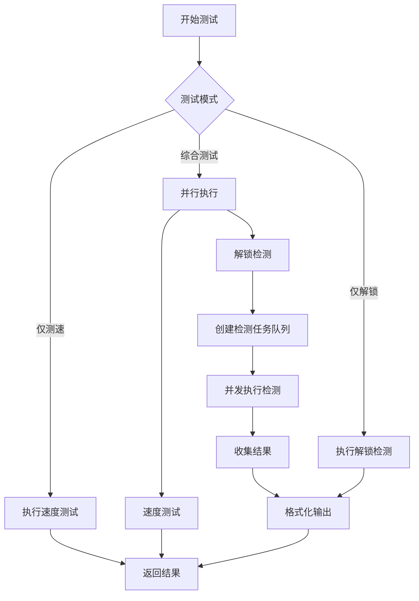

# 流媒体解锁检测功能设计方案

## 1. 功能概述

### 1.1 核心功能
在现有的代理测速功能基础上，新增流媒体解锁检测能力，支持检测节点对 40+ 流媒体平台的访问能力。

### 1.2 测试模式
- **仅测速** (Speed Only)：只进行延迟、下载、上传速度测试
- **仅解锁** (Unlock Only)：只进行流媒体解锁检测
- **综合测试** (Both)：同时进行测速和解锁检测（默认）

### 1.3 目标收益
- 用户可以快速了解节点的流媒体解锁能力
- 帮助用户选择适合观看特定流媒体平台的节点
- 提供详细的地区信息，指导用户选择最佳节点

## 2. 技术架构设计

### 2.1 模块结构

```
backend/
├── unlock/                       # 流媒体解锁检测模块
│   ├── detector.go              # 解锁检测主逻辑
│   ├── types.go                 # 数据类型定义
│   ├── config.go                # 检测配置管理
│   ├── results.go               # 结果处理和格式化
│   ├── services/                # 各平台检测实现
│   │   ├── netflix.go           # Netflix 检测
│   │   ├── disney.go            # Disney+ 检测
│   │   ├── youtube.go           # YouTube Premium 检测
│   │   ├── openai.go            # ChatGPT/OpenAI 检测
│   │   ├── spotify.go           # Spotify 检测
│   │   ├── hbo.go               # HBO Max 检测
│   │   ├── hulu.go              # Hulu 检测
│   │   ├── prime_video.go       # Prime Video 检测
│   │   ├── bilibili.go          # Bilibili 检测
│   │   ├── steam.go             # Steam 货币检测
│   │   └── ...                  # 其他平台
│   └── utils/                   # 工具函数
│       ├── http_client.go       # HTTP 客户端封装
│       ├── user_agent.go        # User-Agent 管理
│       └── parser.go            # HTML/JSON 解析器
├── speedtester/
│   └── speedtester.go           # 集成解锁检测到测速流程
└── main.go                      # API 端点更新
```

### 2.2 核心数据结构

```go
// UnlockResult 单个平台的解锁检测结果
type UnlockResult struct {
    Platform    string    `json:"platform"`      // 平台名称
    Status      string    `json:"status"`        // 状态: unlocked/locked/failed/error
    Region      string    `json:"region"`        // 解锁地区
    Message     string    `json:"message"`       // 额外信息
    Latency     int64     `json:"latency_ms"`    // 检测延迟
    CheckedAt   time.Time `json:"checked_at"`    // 检测时间
}

// UnlockDetector 解锁检测器接口
type UnlockDetector interface {
    Detect(proxy constant.Proxy, timeout time.Duration) *UnlockResult
    GetPlatformName() string
    GetPriority() int  // 检测优先级
}

// UnlockTestConfig 解锁检测配置
type UnlockTestConfig struct {
    Enabled          bool     `json:"enabled"`           // 是否启用
    Platforms        []string `json:"platforms"`         // 要检测的平台列表
    Concurrent       int      `json:"concurrent"`        // 并发检测数
    Timeout          int      `json:"timeout"`           // 单个检测超时（秒）
    RetryOnError     bool     `json:"retry_on_error"`    // 错误时重试
    IncludeIPInfo    bool     `json:"include_ip_info"`   // 包含 IP 信息
}

// TestMode 测试模式枚举
type TestMode string

const (
    TestModeSpeedOnly  TestMode = "speed_only"   // 仅测速
    TestModeUnlockOnly TestMode = "unlock_only"  // 仅解锁
    TestModeBoth       TestMode = "both"         // 两者都测（默认）
)
```

### 2.3 API 接口设计

#### 2.3.1 更新现有测试请求结构

```go
type TestRequest struct {
    // 现有字段...
    ConfigPaths      string   `json:"configPaths"`
    FilterRegex      string   `json:"filterRegex"`
    
    // 新增字段
    TestMode         string   `json:"testMode"`         // 测试模式
    UnlockConfig     UnlockTestConfig `json:"unlockConfig"` // 解锁检测配置
}
```

#### 2.3.2 新增 API 端点

```
GET  /api/unlock/platforms        # 获取支持的平台列表
POST /api/unlock/test/:proxyId   # 测试单个节点的解锁情况
GET  /api/unlock/regions          # 获取支持的地区列表
```

#### 2.3.3 更新测试结果结构

```go
type Result struct {
    // 现有字段...
    ProxyName       string         `json:"proxy_name"`
    ProxyType       string         `json:"proxy_type"`
    Latency         time.Duration  `json:"latency"`
    DownloadSpeed   float64        `json:"download_speed"`
    UploadSpeed     float64        `json:"upload_speed"`
    
    // 新增字段
    UnlockResults   []UnlockResult `json:"unlock_results"`    // 解锁检测结果
    UnlockSummary   string         `json:"unlock_summary"`    // 解锁结果摘要
    IPInfo          *IPInfo        `json:"ip_info,omitempty"` // IP 信息
}

type IPInfo struct {
    IP          string  `json:"ip"`
    Country     string  `json:"country"`
    City        string  `json:"city"`
    ISP         string  `json:"isp"`
    RiskScore   int     `json:"risk_score"`  // IP 风险值 (0-100)
}
```

### 2.4 WebSocket 消息更新

```go
// 新增消息类型
const (
    // 现有类型...
    MessageTypeUnlockStart   MessageType = "unlock_start"    // 开始解锁检测
    MessageTypeUnlockResult  MessageType = "unlock_result"   // 单个平台结果
    MessageTypeUnlockComplete MessageType = "unlock_complete" // 解锁检测完成
)

// UnlockProgressData 解锁检测进度数据
type UnlockProgressData struct {
    ProxyName       string  `json:"proxy_name"`
    ProxyType       string  `json:"proxy_type"`
    Platform        string  `json:"platform"`          // 当前检测的平台
    Progress        float64 `json:"progress"`          // 进度百分比
    CompletedCount  int     `json:"completed_count"`   // 已完成平台数
    TotalCount      int     `json:"total_count"`       // 总平台数
}
```

## 3. 功能实现设计

### 3.1 检测流程



### 3.2 平台检测优先级

根据平台的流行度和重要性设置检测优先级：

1. **高优先级** (Priority 1)：Netflix、YouTube、Disney+、ChatGPT、Spotify
2. **中优先级** (Priority 2)：HBO Max、Hulu、Prime Video、Bilibili
3. **低优先级** (Priority 3)：其他区域性平台

### 3.3 并发控制策略

```go
// 使用带权重的信号量控制并发
type ConcurrencyController struct {
    semaphore    chan struct{}
    maxConcurrent int
}

// 检测执行器
func (d *Detector) ExecuteDetection(proxy constant.Proxy, platforms []string) []UnlockResult {
    results := make([]UnlockResult, 0)
    resultsChan := make(chan UnlockResult, len(platforms))
    
    var wg sync.WaitGroup
    controller := NewConcurrencyController(d.config.Concurrent)
    
    // 按优先级排序平台
    sortedPlatforms := d.sortByPriority(platforms)
    
    for _, platform := range sortedPlatforms {
        wg.Add(1)
        go func(p string) {
            defer wg.Done()
            controller.Acquire()
            defer controller.Release()
            
            detector := d.getDetector(p)
            result := detector.Detect(proxy, d.config.Timeout)
            resultsChan <- result
        }(platform)
    }
    
    wg.Wait()
    close(resultsChan)
    
    // 收集结果
    for result := range resultsChan {
        results = append(results, result)
    }
    
    return results
}
```

### 3.4 错误处理和重试机制

```go
// 带重试的检测
func (d *BaseDetector) DetectWithRetry(proxy constant.Proxy, maxRetries int) *UnlockResult {
    var lastError error
    
    for i := 0; i <= maxRetries; i++ {
        result := d.Detect(proxy)
        
        if result.Status != "error" {
            return result
        }
        
        lastError = fmt.Errorf(result.Message)
        
        // 指数退避
        if i < maxRetries {
            time.Sleep(time.Duration(math.Pow(2, float64(i))) * time.Second)
        }
    }
    
    return &UnlockResult{
        Platform: d.GetPlatformName(),
        Status:   "error",
        Message:  fmt.Sprintf("Failed after %d retries: %v", maxRetries, lastError),
    }
}
```

## 4. 前端集成设计

### 4.1 UI 组件更新

```typescript
// 测试模式选择组件
interface TestModeConfig {
    mode: 'speed_only' | 'unlock_only' | 'both';
    unlockPlatforms?: string[];
}

// 解锁结果展示组件
interface UnlockResultDisplay {
    platform: string;
    status: 'unlocked' | 'locked' | 'failed' | 'error';
    region?: string;
    latency?: number;
}
```

### 4.2 用户交互流程

1. **模式选择**：用户在开始测试前选择测试模式
2. **平台选择**：可选择要检测的流媒体平台（默认检测主流平台）
3. **实时进度**：通过 WebSocket 实时显示检测进度
4. **结果展示**：以表格或卡片形式展示解锁结果

## 5. 性能优化策略

### 5.1 缓存机制

```go
// 节点解锁结果缓存
type UnlockCache struct {
    cache sync.Map // key: proxyName+platform, value: CachedResult
}

type CachedResult struct {
    Result    UnlockResult
    ExpiresAt time.Time
}

// 缓存有效期：30分钟
const CacheTTL = 30 * time.Minute
```

### 5.2 智能检测策略

- **快速失败**：如果节点延迟测试失败，跳过解锁检测
- **分组检测**：将平台分组，优先检测重要平台
- **条件跳过**：某些平台失败后，跳过相关平台（如 Netflix 失败，跳过其他美国平台）

### 5.3 资源控制

- **HTTP 连接池**：复用 TCP 连接，减少握手开销
- **超时控制**：严格控制每个检测的超时时间
- **内存管理**：及时释放检测过程中的临时数据

## 6. 配置管理

### 6.1 默认配置

```yaml
unlock:
  enabled: true
  concurrent: 5
  timeout: 10
  retry_on_error: true
  include_ip_info: true
  default_platforms:
    - Netflix
    - YouTube
    - Disney+
    - ChatGPT
    - Spotify
    - Bilibili
```

### 6.2 环境变量

```bash
UNLOCK_ENABLED=true              # 启用解锁检测
UNLOCK_CONCURRENT=5              # 并发检测数
UNLOCK_TIMEOUT=10                # 检测超时（秒）
UNLOCK_PLATFORMS=Netflix,YouTube # 默认检测平台
```

## 7. 监控和日志

### 7.1 日志记录

```go
// 解锁检测日志
logger.Info("Unlock detection started",
    slog.String("proxy_name", proxyName),
    slog.Int("platform_count", len(platforms)),
    slog.String("test_mode", testMode),
)

logger.Debug("Platform detection result",
    slog.String("platform", platform),
    slog.String("status", result.Status),
    slog.String("region", result.Region),
    slog.Int64("latency_ms", result.Latency),
)
```

### 7.2 指标收集

- 各平台的解锁成功率
- 检测延迟分布
- 错误类型统计
- 缓存命中率

## 8. 安全考虑

### 8.1 请求伪装

- 随机 User-Agent
- 模拟真实浏览器请求头
- 避免过于频繁的请求

### 8.2 隐私保护

- 不记录用户访问的具体内容
- 仅记录解锁状态和地区信息
- 敏感信息脱敏处理

## 9. 扩展性设计

### 9.1 插件化平台支持

```go
// 平台检测器注册
type DetectorRegistry struct {
    detectors map[string]UnlockDetector
}

func (r *DetectorRegistry) Register(name string, detector UnlockDetector) {
    r.detectors[name] = detector
}

// 动态加载新平台
func LoadCustomDetector(path string) error {
    // 从外部文件加载自定义检测器
}
```

### 9.2 自定义检测规则

支持用户通过配置文件定义新的检测规则，无需修改代码。

## 10. 实施计划

### Phase 1: 核心功能（1周）
- [ ] 实现解锁检测基础框架
- [ ] 完成 5 个主流平台检测（Netflix、YouTube、Disney+、ChatGPT、Spotify）
- [ ] 集成到现有测速流程

### Phase 2: 平台扩展（1周）
- [ ] 实现其余 35+ 平台检测
- [ ] 优化并发控制和性能
- [ ] 添加缓存机制

### Phase 3: 前端集成（3天）
- [ ] 更新前端 UI 组件
- [ ] 实现实时进度展示
- [ ] 优化结果展示

### Phase 4: 优化和测试（3天）
- [ ] 性能优化
- [ ] 完善错误处理
- [ ] 编写测试用例
- [ ] 文档完善

## 11. 风险和挑战

1. **反爬虫机制**：部分平台可能检测并阻止自动化访问
2. **API 变更**：流媒体平台可能更改检测端点或返回格式
3. **性能影响**：大量并发检测可能影响整体测试速度
4. **准确性**：某些平台的检测结果可能不够准确

## 12. 总结

本方案通过模块化设计、插件化架构和智能检测策略，为 clash-speedtest 项目添加了完整的流媒体解锁检测功能。该功能将大大提升用户体验，帮助用户更好地选择适合的代理节点。